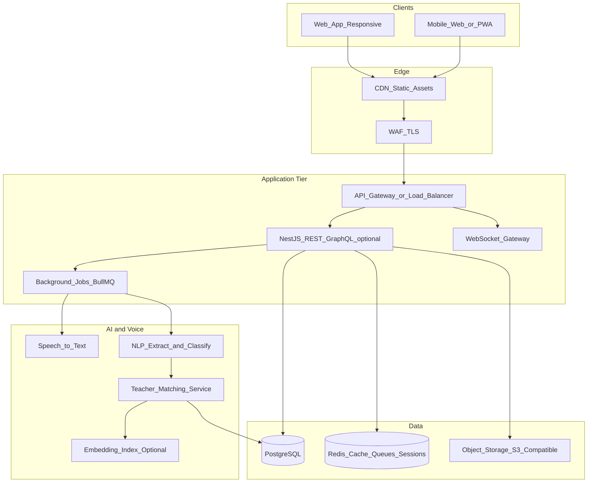
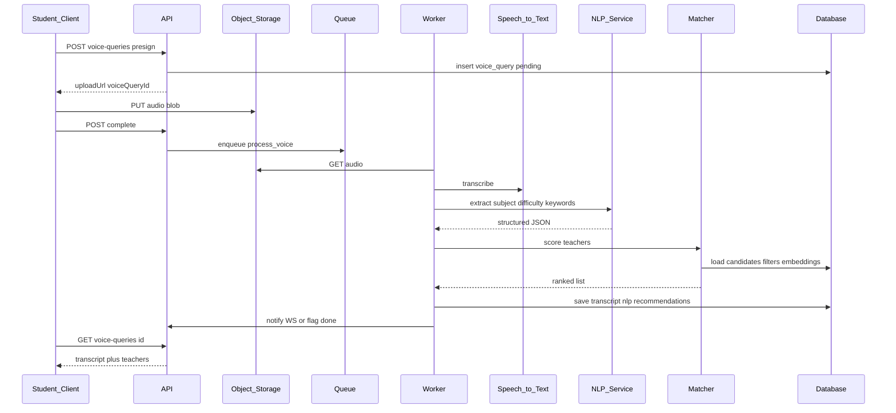

# Smart Teacher–Student Bridge: Architecture & Implementation Plan

## Assumptions (adjust during build)

- **Greenfield**: No existing backend/UI in [Projects](c:\Users\U1110056\Pulse.AI\Projects) for this app; [particle-camera](c:\Users\U1110056\Pulse.AI\Projects\particle-camera) is out of scope.
- **Stack default**: **TypeScript end-to-end** — **NestJS** (API + WebSockets), **PostgreSQL**, **React** (Vite) or **Next.js** (if SSR/SEO for public teacher listings is a priority). Alternatives: **Django + DRF** or **.NET 8 Minimal APIs** if your org standardizes on Python/C#.
- **Speech**: **Azure Speech-to-Text** or **Google Cloud Speech-to-Text** for production reliability; **Whisper** (self-hosted or API) as a cost-controlled option. NLP layer can call **OpenAI / Azure OpenAI** for structured extraction (subject, difficulty, keywords) with a **rules + embeddings** fallback for cost control.

---

## 1. High-level architecture

- **Synchronous path**: Auth, search, CRUD, dashboards.
- **Async path**: Upload voice → store blob → job queue → STT → NLP → match scores → persist recommendations → notify client (poll or WebSocket).

---

## 2. Recommended technology choices

| Layer        | Choice                                                                                                                         | Rationale                                                                        |
| ------------ | ------------------------------------------------------------------------------------------------------------------------------ | -------------------------------------------------------------------------------- |
| API          | NestJS + TypeORM or Prisma                                                                                                     | Modular boundaries, guards for RBAC, first-class DI, easy OpenAPI                |
| DB           | PostgreSQL 15+                                                                                                                 | JSON for flexible NLP metadata; full-text search optional (`tsvector`)           |
| Cache / jobs | Redis + BullMQ                                                                                                                 | Rate limits, session store, async voice pipeline                                 |
| Auth         | OAuth2 (Google/Microsoft) + **JWT** (short-lived access + rotating refresh in **httpOnly cookie** or secure storage on mobile) | Industry standard; NestJS `@nestjs/passport`                                     |
| Files        | S3-compatible (AWS S3, Azure Blob, MinIO)                                                                                      | Presigned URLs for direct browser upload; virus scan in worker (optional ClamAV) |
| Real-time    | Socket.io or native WS in NestJS                                                                                               | Session updates, notification when voice job completes                           |
| Frontend     | React + TanStack Query + Zustand/Context; **responsive CSS** (Tailwind or MUI)                                                 | Fast iteration; role-based route splits                                          |

---

## 3. Database schema (core entities)

**Users & auth**

- `users` — id, email, password_hash (if email auth), oauth_provider_ids, role enum (`teacher`  `student`), status, created_at.
- `profiles` — user_id FK, display_name, avatar_url, bio, locale, timezone.
- `teacher_profiles` — user_id FK, headline, years_experience, hourly_rate_cents, currency, teaching_preferences JSON, **specialization** FK to `subjects` or M2M `teacher_subjects`.
- `student_profiles` — user_id FK, grade_level optional, goals text.

**Taxonomy**

- `subjects` — id, name, slug (Math, Physics, …).
- `tags` — id, name (expertise tags); `teacher_tags` M2M.

**Availability & pricing**

- `availability_slots` — teacher_id, start/end UTC, recurrence rule optional (or separate `recurrence` table).
- Indexes on `(teacher_id, start_at)` for filtering.

**Discovery & ratings**

- `reviews` — student_id, teacher_id, session_id optional, rating 1–5, comment, created_at; unique constraint to prevent duplicate reviews per session if business rule requires.

**Sessions & progress**

- `sessions` — teacher_id, student_id, scheduled_at, status (`scheduled`  `completed`  `cancelled`), notes, metadata.
- `progress_entries` — student_id, teacher_id optional, subject_id, metric_key, value JSON, recorded_at — powers charts.

**Documents**

- `documents` — owner_user_id, role context, title, storage_key, mime_type, size_bytes, created_at; optional `session_id` or `folder` for organization.

**Voice & recommendations**

- `voice_queries` — student_id, audio_storage_key, transcript text, nlp_result JSON (subject_id, difficulty, keywords[]), status (`pending`  `done`  `failed`), created_at.
- `voice_query_recommendations` — voice_query_id, teacher_id, score, rank, reason JSON — audit trail for “why these teachers.”

**Favorites**

- `saved_teachers` — student_id, teacher_id, created_at, unique (student_id, teacher_id).

**RBAC**

- Enforce at API with guards: JWT claims include `role` and `userId`; resource ownership checks (e.g., only owner can delete their documents).

---

## 4. API specification (REST, versioned `/api/v1`)

**Auth**

- `POST /auth/register` — body: role, email, password; returns tokens or sets cookies.
- `POST /auth/login`
- `POST /auth/refresh`
- `POST /auth/logout`
- `GET /auth/me` — profile + role.

**Teachers (authenticated teacher)**

- `GET/PUT /teachers/me` — profile, specialization, tags, preferences.
- `GET/PUT /teachers/me/availability`
- `GET /teachers/me/sessions` — filters: status, date range.
- `GET /teachers/me/students/:studentId/progress`
- `POST /teachers/me/documents` — initiate upload (presigned URL response).
- `DELETE /teachers/me/documents/:id`

**Public / student discovery**

- `GET /teachers` — query: `q`, `subject`, `min_rating`, `max_price`, `available_from`, `available_to`, `sort`, `page`, `limit` — **standard search/filtering** as required.
- `GET /teachers/:id` — public profile + aggregates (avg rating, review count).

**Students**

- `GET/PUT /students/me`
- `GET /students/me/sessions`
- `GET /students/me/saved-teachers` — `POST` / `DELETE` for save/unsave.
- `GET /students/me/progress` — aggregated stats + time series for charts.
- `POST /students/me/documents` — presigned upload.

**Voice pipeline**

- `POST /voice-queries` — returns `{ uploadUrl, voiceQueryId }` or multipart upload id.
- `POST /voice-queries/:id/complete` — client signals upload finished; **worker** runs STT → NLP → match.
- `GET /voice-queries/:id` — poll status + transcript + recommendations when ready.
- Optional: WebSocket event `voiceQuery.completed` with same payload.

**WebSockets (optional)**

- Namespace `/ws` — authenticate with JWT; subscribe to `user:{userId}` for notifications.

**OpenAPI**: Generate from NestJS decorators (`@nestjs/swagger`) so frontend and tests stay aligned.

---

## 5. Voice processing flow

**Matching algorithm (pragmatic v1)**

1. Filter teachers by **subject** (from NLP) and **availability/price** bounds if extracted.
2. Score: weighted sum of **rating**, **tag overlap** with NLP keywords, **specialization match**, optional **embedding similarity** between problem text and teacher bio/tags.
3. Return top N with **explainability** (short reason per teacher).

---

## 6. Authentication and security

- **HTTPS only**; **CORS** restricted to known origins.
- **JWT**: access token 15 min; refresh 7–30 days; store refresh securely; rotate on use.
- **Passwords**: Argon2id or bcrypt; rate limit login/register.
- **RBAC**: NestJS guards — `Roles('teacher')`, ownership checks on `user_id` resources.
- **File uploads**: Presigned PUT with **content-type and max size**; private buckets; no public listing.
- **PII**: Minimize in logs; encrypt secrets via KMS/Vault.
- **Headers**: Helmet; CSP for XSS; CSRF if cookie-based session (double-submit or SameSite strict).

---

## 7. Frontend implementation plan

1. **Shell**: Auth pages, layout by role (`/teacher/`*, `/student/`*), protected routes.
2. **Teacher dashboard**: sessions list/calendar, student progress views, document manager, profile/settings.
3. **Student dashboard**: sessions, progress charts (e.g. Recharts), saved teachers, documents, profile.
4. **Discovery**: filterable teacher grid + detail page.
5. **Voice UX**: `MediaRecorder` API, upload progress, job status polling or WebSocket, results list with match reasons.
6. **Responsive**: mobile-first breakpoints; touch-friendly controls for recording.

---

## 8. Backend implementation plan

1. **Project bootstrap**: NestJS modules — `Auth`, `Users`, `Teachers`, `Students`, `Sessions`, `Documents`, `Voice`, `Notifications` (optional).
2. **Persistence**: migrations (Prisma/TypeORM); seed subjects/tags.
3. **Storage service**: abstraction over S3 for presigned URLs.
4. **Workers**: Bull processors for `processVoiceQuery`.
5. **Integration**: STT + NLP clients with timeouts, retries, structured errors.
6. **Observability**: structured logging (Pino), request IDs, health checks `/health/live` and `/health/ready`.

---

## 9. Deployment strategy

- **Containers**: Docker multi-stage builds for API and worker; same image, different `CMD` (API vs worker).
- **Orchestration**: **Kubernetes** (EKS/AKS/GKE) or **managed** simpler path: **Railway / Fly.io / Render** for API + worker + **managed PostgreSQL + Redis**.
- **Frontend**: static hosting (**CloudFront + S3**, **Azure Static Web Apps**, or **Vercel** if Next.js).
- **CI/CD**: GitHub Actions — lint, test, build image, deploy; migrations as a job before rollout.
- **Environments**: `dev` / `staging` / `prod` with separate DB and storage buckets; feature flags for risky AI paths.

---

## 10. Deliverables checklist (what you will have after implementation)

| Deliverable             | Form                                     |
| ----------------------- | ---------------------------------------- |
| Architecture            | Diagrams + module boundaries (this plan) |
| Frontend + backend plan | Phased modules above                     |
| API specifications      | OpenAPI 3 YAML from NestJS               |
| Database schema         | Migrations + ERD from Prisma/TypeORM     |
| Voice flow              | Sequence + worker + storage contract     |
| Auth & security         | JWT/OAuth, RBAC, storage hardening       |
| Deployment              | Docker + env matrix + CI/CD outline      |

---

## 11. Suggested phased delivery

1. **MVP**: Auth, roles, teacher/student profiles, teacher search (no voice), sessions, documents, basic dashboards.
2. **V2**: Voice upload → STT → NLP → matching; WebSocket notifications.
3. **V3**: Embeddings-based ranking, advanced analytics, native mobile app if needed (API already supports PWA).

No code changes are proposed in this plan phase; once you approve, implementation can start in a new app directory under your workspace with the stack you confirm (NestJS + React is the default above).
